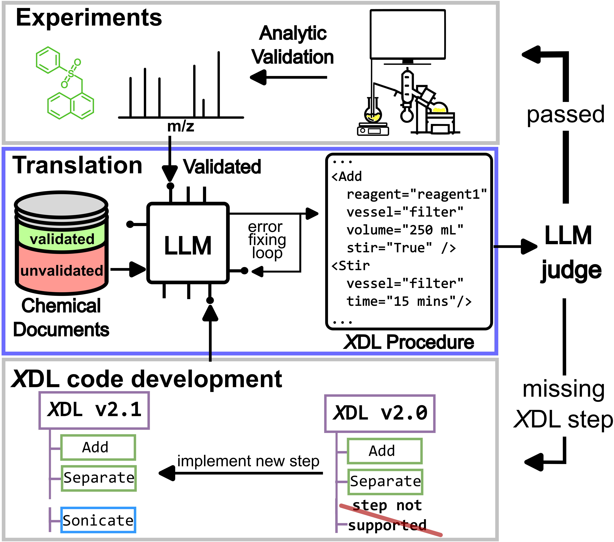

# Verification and Execution of the Scientific Literature via Chemputation Augmented by Large Language Models 
<a id="readme-top"></a>

by
Sebastian Pagel,
Michael Jirasek,
Leroy Cronin


This paper has been preprinted on [ChemRxiv](https://arxiv.org/abs/2410.06384)

In this work we introduce a LLM based framework called ACRA (Autonomous Chemical Reaction Agents) for the automatic validation of chemical synthesis. ACRA is configured as a Multi-Agent workflow to parse, sanitize, translate, and execute chemical reactions on a synthetic platform (Chemputer) via the Chemical Description Language ([*X*DL](https://www.science.org/doi/10.1126/science.abc2986))

<p align="center">

</p>


## Abstract

Large Language Models (LLMs) have demonstrated remarkable capabilities in various domains, including natural language processing, robotic-control, and more recently, chemistry. Despite significant advancements in standardizing the reporting and collection of synthetic chemistry data, the automatic reproduction of reported syntheses remains a labour-intensive task. In this work, we introduce an LLM-based chemical research agent designed for the automatic validation of synthetic literature procedures. Our workflow can autonomously extract synthetic procedures and analytical data from extensive documents, translate these procedures into universal XDL code, simulate the execution of the procedure in a hardware-specific setup, and ultimately execute the procedure on an XDL-controlled robotic system for synthetic chemistry. This demonstrates the potential of LLM-based workflows in self-driving laboratories. Unlike previous efforts, which either addressed only a limited portion of the workflow, relied on inflexible hard-coded rules, or lacked validation in physical systems, our approach provides four realistic examples of syntheses directly executed from synthetic literature. We anticipate that our workflow will significantly enhance automation in robotically driven synthetic chemistry research, streamline data extraction, and improve reproducibility of synthetic chemistry.
</br>

<!-- TOC -->
## Table of Contents
<details>
  <summary>Expand</summary>
  <ol>
    <li>
      <a href="#abstract">About the project</a>
    </li>
    <li>
      <a href="#project-organization">Project Organization</a>
    </li>
    <li>
      <a href="#software-implementation">Software and Installation</a>
        <ul>
        <li><a href="#getting-the-code">Getting the Code</a></li>
        <li><a href="#dependencies">Dependencies</a></li>
        </ul>
    </li>
    <li><a href="#license">License</a></li>
  </ol>
</details>
</br>

## Project Organization

```
│
├── acra - source code of the project
│   ├──agents/agents/... - LLM agents
│   ├──agents/prompt/... - LLM agent prompt templates
│   ├──paperscraper/... - Paperscraper agent & prompt
│   ├──laboratory/... - code for chemicals (to be extended with lab-specific code)
│   ├──utils/... - logging, testing, prompting utils
│   ├──data/... - initilization data, vector-databases etc.
│   ├──config.py - contains model run run configs
│   └──main.py - contains entry function paper_to_xdl and procedure_to_xdl
├── notebooks - Notebooks for experiments
├── data - logging data from experiments, papers, etc
└── static - README content

```

<p align="right">(<a href="#readme-top">back to top</a>)</p>

## Software implementation

All source code used to generate the results and figures in the paper are in
the `acra` folder.
The calculations and figure generation are all run inside
[Jupyter notebooks](http://jupyter.org/).

### Getting the code

You can download a copy of all the files in this repository by cloning the
[git](https://git-scm.com/) repository:

    git clone https://github.com/croningp/acra


### Dependencies

You'll need a working Python environment to run the code.
The recommended way to set up your environment is through the
[Anaconda Python distribution](https://www.anaconda.com/download/) which
provides the `conda` package manager.
Anaconda can be installed in your user directory and does not interfere with
the system Python installation.
The required dependencies are specified in the file `environment.yml`.

We use `conda` virtual environments to manage the project dependencies in
isolation.

Run the following command in the repository folder (where `environment.yml`
is located) to create a separate environment and install all required
dependencies in it:

    cd acra
    conda env create -f environment.yml
    conda activate acra

Install locally:

    pip install -e .

Ensure to set the environment variables

    export CHAT_API_KEY = ...
and 

    export EMBEDDING_API_KEY = ...
These can be set to the same key, and are expected to be OPENAI api keys

<p align="right">(<a href="#readme-top">back to top</a>)</p>

## Experiments

For translation of procedures/extraction from a PDF the following folder structure will be generated in the defined experiment name:
```
run_name <- e.g. data/memory/benchmark_10_papers_run_1
├───labbook
  ├─── procedure_name.json <- translation graph containig XDL translation details for a single procedure
  ...
  └─── N
├───papers
│   ├───0
      ├─── paper_embed.pkl <- embedded document
      └─── ps_response.json <- extracted knowledge graph
    ...
│   └───N
└───XDL_procedures
    ├───graphs
    ├───procedures
    ├───reaction_smiles
    ├───vectordb
    └───xdls
```


<p align="right">(<a href="#readme-top">back to top</a>)</p>

The files in notebooks/ contain the following experiments/ visulations

* benchmark_memory.ipynb
  * benchmark notebook to generate the data for Figure 5
* benchmark_translation.ipynb
  * benchmark notebook to perform the translation of procedures/ primary literature into XDL
* Figures.ipynb
  * Scripts to generate subfigures for Figure 3-6 and SI Figures
* procedure_to_xdl_template.ipynb
  * template notbooks to perform translation of a procedure

## License

All source code is made available under a BSD 3-clause license. You can freely
use and modify the code, without warranty, so long as you provide attribution
to the authors. See `LICENSE.md` for the full license text.

The manuscript text is not open source. The authors reserve the rights to the
article content.
